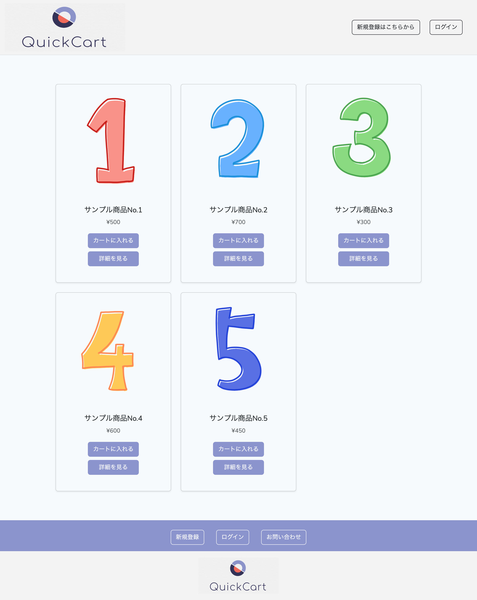
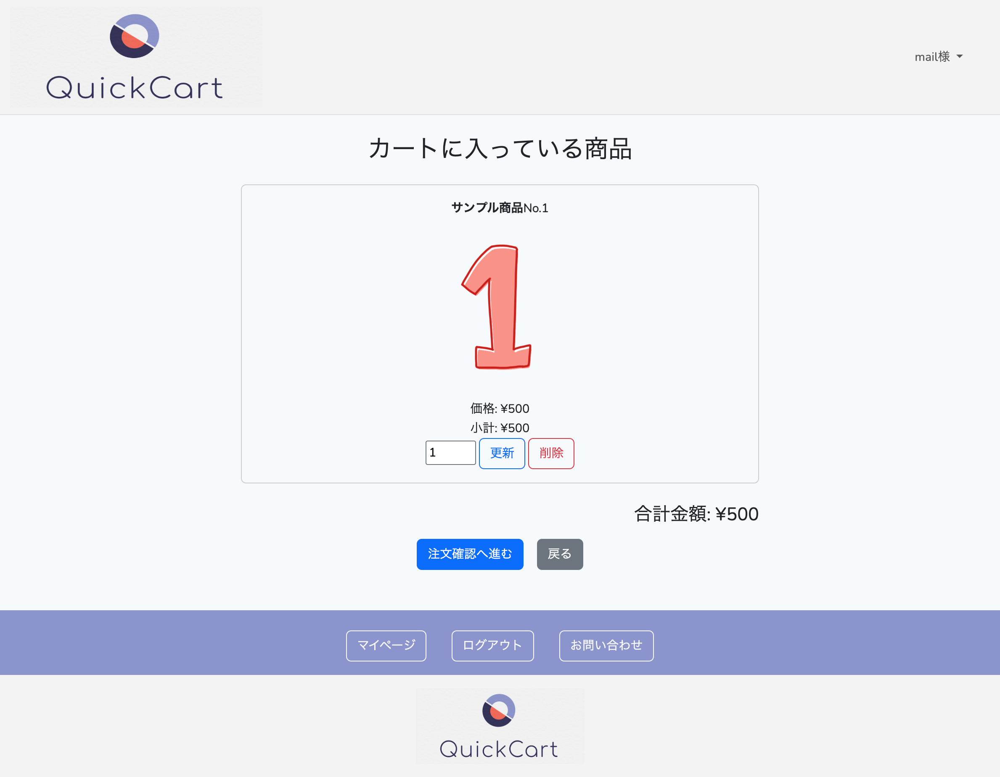
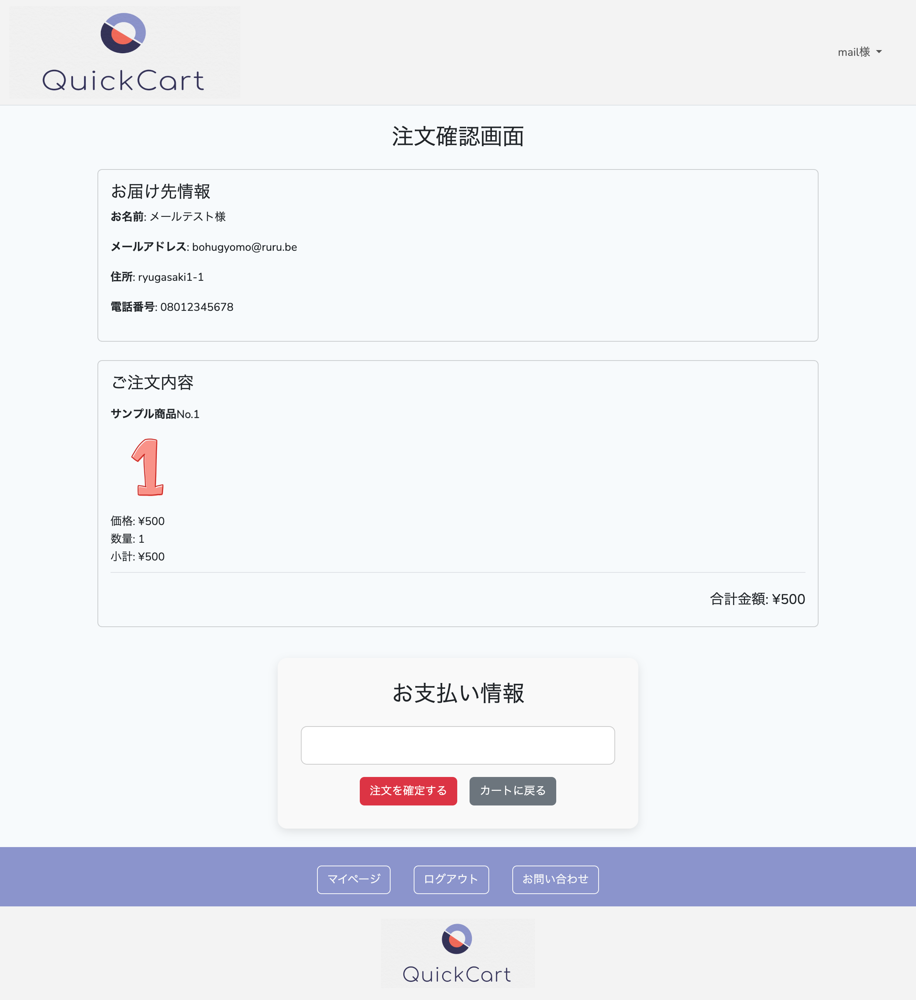

# QuickCart（Laravelを使った自作ECサイト）


## 使用技術一覧

## 目次

1. [プロジェクトについて](#プロジェクトについて)
2. [環境](#環境)
3. [機能概要](#機能概要)
4. [スクリーンショット](#スクリーンショット)
5. [ディレクトリ構成](#ディレクトリ構成)
6. [セットアップ手順](#セットアップ手順)
7. [認証機能](#認証機能)
8. [Stripe連携](#stripe連携)
9. [メール通知](#メール通知)

## プロジェクトについて

QuickCartは、LaravelとStripeを活用したシンプルなECカートアプリケーションです。 商品一覧、カート機能、注文確認、Stripeによる決済、注文確認メール送信などの機能を備えています。

## 環境

| 項目      | バージョン   |
| ------- | ------- |
| PHP     | 8.2.9   |
| Laravel | 12.12.0 |
| MySQL   | 14.14   |
| Node.js | 22.15.0 |

その他の依存パッケージは `composer.json` と `package.json` を参照してください。

## 機能概要

* 商品一覧／詳細表示
* カート追加／編集／削除
* 注文確認画面（認証ユーザーのみ）
* Stripeによるクレジットカード決済
* 注文確認メール送信（ジョブ＆キュー使用）

## スクリーンショット





## ディレクトリ構成

（省略せず一部表示）

```
├── app
│   ├── Http/Controllers
│   ├── Jobs/SendOrderConfirmationEmail.php
│   ├── Mail/OrderCompletedMail.php
│   ├── Models/CartItem.php
│   ├── Models/Item.php
│   ├── Models/Order.php
│   └── Models/User.php
├── database/migrations
├── public/images
├── resources/views
│   ├── cart_item.blade.php
│   ├── order/
│   └── show_item.blade.php
├── routes/web.php
├── .env
├── composer.json
├── package.json
└── README.md
```

## セットアップ手順

```bash
git clone https://github.com/yourname/quick-cart.git
cd quick-cart
composer install
cp .env.example .env
php artisan key:generate
npm install && npm run dev
php artisan migrate --seed
php artisan serve
```

## 認証機能

Laravel Breeze を使用し、登録・ログイン機能を提供しています。

## Stripe連携

* Stripe Elements によりカード情報を安全に入力
* Laravel Cashier により支払い処理を実行
* SetupIntent を使い、カードを事前にセットアップ

## メール通知

* 注文完了後に確認メールを送信
* Laravel の Queue / Job 機能を使用し非同期で送信
* Mailtrap を使用したSMTPテスト環境を設定済み


